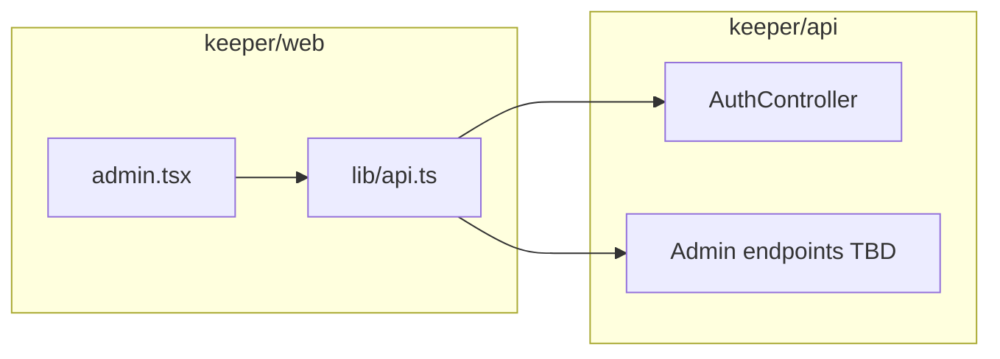

# Admin page — endpoints checklist

Working checklist for wiring the admin dashboard and shared admin chrome to the ASP.NET API. Tick items as you implement.

## Purpose

- Replace stubbed React Query `queryFn`s in [`src/routes/admin.tsx`](../src/routes/admin.tsx) and align URLs with the real API (`/api/...` prefix).
- Wire [`AdminSidebar`](../src/components/admin/AdminSidebar.tsx) (session display, logout).
- Add or extend server endpoints where the UI needs org-wide data (not donor-scoped).

Reference patterns: [`src/lib/api.ts`](../src/lib/api.ts) (`getApiBaseUrl`, `apiGetJson`, `credentials: "include"`), [`src/routes/dashboard.tsx`](../src/routes/dashboard.tsx) (mapping camelCase API rows to UI types).

## Architecture (high level)

## Environment and cross-origin

- [ ] `VITE_API_BASE_URL` set for local/dev/prod (no trailing slash; see `getApiBaseUrl()`).
- [ ] API CORS allows the web origin and supports credentialed requests (`credentials: "include"` from the browser).
- [ ] Auth cookies (name, `SameSite`, secure flag) work for your deployment topology (localhost vs deployed hosts).

Files to verify: [`keeper/api/src/Program.cs`](../../api/src/Program.cs), [`keeper/api/src/appsettings.json`](../../api/src/appsettings.json).

## Auth checklist

- [ ] **Session / identity:** `GET /api/auth/me` — returns `email`, `roles`, `supporterId` (camelCase). No `full_name` today.
- [ ] **Display name:** Either derive from `email` (e.g. local-part, as in donor dashboard) or extend `AuthUserResponse` / join `Supporters` for a proper name field.
- [ ] **Admin-only UI:** Optionally call `GET /api/auth/admin-only` (`[Authorize(Roles = Admin)]`) to confirm role before showing admin chrome; handle **403** vs redirect to login or donor dashboard.
- [ ] **Route guard:** Decide if `/admin` and sibling admin-layout routes require **Admin** (or **Staff**) on the client (redirect) and ensure new list endpoints enforce the same on the server.
- [ ] **Logout:** `POST /api/auth/logout` from the sidebar (see working example in [`src/components/landing/Navbar.tsx`](../src/components/landing/Navbar.tsx)).

## Data endpoints (likely new on API)

The admin dashboard currently expects list/feed data that **no existing controller** exposes in full. `GET /api/donor/donations` is **current user only**. Public impact routes expose **aggregates** (e.g. safehouse count), not roster + occupancy.

| UI need | Used by | Suggested route (example) | Authorize | Notes |
|--------|---------|---------------------------|-----------|--------|
| Residents list | `AdminMetrics`, `DonationTrends`, `CasesTable` | e.g. `GET /api/admin/residents` or staff-scoped | Admin and/or Staff | Map EF [`Resident`](../../api/src/Models/Resident.cs) to UI shape (see DTO mapping below). |
| Org-wide donations | `AdminMetrics`, `DonationTrends` | e.g. `GET /api/admin/donations` (query: date range, paging) | Admin and/or Staff | Not `DonorController`; may include donor email for display if policy allows. |
| Safehouses + occupancy | `AdminMetrics`, `OccupancyList` | e.g. `GET /api/admin/safehouses` | Admin and/or Staff | May need join/count of residents per safehouse + capacity from DB. |
| Activity feed | `ActivityFeed` | e.g. `GET /api/admin/activity` | Admin and/or Staff | No obvious single table in API layer today; define source (audit log, union of events, or phased mock). |

- [ ] Residents endpoint + DTOs
- [ ] Donations endpoint + DTOs
- [ ] Safehouses endpoint + DTOs
- [ ] Activity feed endpoint (or interim static/empty contract)

## DTO / field mapping (web ↔ API)

Prefer **camelCase** JSON from C#. Add a small mapper in the route or a shared helper (like `mapDonorDonationApi` in `dashboard.tsx`).

### Resident (UI: [`AdminMetrics`](../src/components/admin/AdminMetrics.tsx))

| UI field | EF / domain notes |
|----------|-------------------|
| `id` | e.g. `ResidentId` as string |
| `status` | Define rule (e.g. from `DateClosed`, `CaseStatus`, or new computed field) |
| `case_status` | `CaseStatus` |
| `resident_code` | e.g. `InternalCode` or `CaseControlNo` |
| `risk_level` | e.g. `CurrentRiskLevel` or `InitialRiskLevel` |

- [ ] Document chosen mapping in code comments or API XML docs.

### Donation (UI)

| UI field | Typical source |
|----------|----------------|
| `id`, `amount`, `created_date` | Donation id, amount, date |
| `type`, `campaign`, `allocation`, `donor_email` | Optional; policy-sensitive |

- [ ] Align with existing donor DTO patterns where possible ([`DonorController`](../../api/src/Controllers/DonorController.cs)).

### Safehouse (UI)

| UI field | Notes |
|----------|--------|
| `id`, `name`, `location`, `status` | From `Safehouses` + business rules |
| `capacity`, `current_occupancy` | Capacity from entity; occupancy from resident counts |

### Activity (UI: [`ActivityFeed`](../src/components/admin/ActivityFeed.tsx))

| UI field | Notes |
|----------|--------|
| `id`, `type`, `description`, `created_date` | Required for icons and sorting |
| `performed_by` | Optional |

Supported `type` values for icons: `Donation`, `Counseling`, `HomeVisit`, `Incident`, `CaseConference`, `Admission`, `Graduation`.

- [ ] API returns types that match this set or map server enums to these strings.

## Quick actions ([`QuickActions.tsx`](../src/components/admin/QuickActions.tsx))

Buttons are currently non-functional. When product defines behavior:

- [ ] **Add Resident** — target route and/or `POST` endpoint.
- [ ] **Log Donation** — target route and/or `POST` endpoint (may differ from public donation flow).
- [ ] **Record Session** — target route and/or `POST` endpoint.
- [ ] **Log Visit** — target route and/or `POST` endpoint.

## Sibling admin-layout routes

Same auth and API conventions should apply when you wire data:

- [`src/routes/caseload.tsx`](../src/routes/caseload.tsx)
- [`src/routes/donors-contributions.tsx`](../src/routes/donors-contributions.tsx)
- [`src/routes/home-visitations.tsx`](../src/routes/home-visitations.tsx)
- [`src/routes/process-recordings.tsx`](../src/routes/process-recordings.tsx)
- [`src/routes/reports.tsx`](../src/routes/reports.tsx)

- [ ] Shared helper for `fetchCurrentUser` / logout to avoid duplicating `dashboard.tsx`.

## Testing (manual)

- [ ] Sign in as a user with **Admin** role; load `/admin`; confirm network calls succeed.
- [ ] Sign in as **Donor** (or without Admin); confirm guard and/or 403 handling.
- [ ] Logout from sidebar clears session and UI updates.
- [ ] Empty lists: dashboard still renders without errors.

## Out of scope / later

- **ML retrain:** Python service exposes admin retrain under its own router ([`keeper/ml-pipelines/app/routers/admin.py`](../../ml-pipelines/app/routers/admin.py)). ASP.NET [`MlController`](../../api/src/Controllers/MlController.cs) does not expose retrain today; only wire if reports/admin need to trigger training from the browser via the API.

## Existing API surface (quick reference)

| Method | Path | Notes |
|--------|------|--------|
| GET | `/api/auth/me` | Current user; roles for authorization UI |
| GET | `/api/auth/admin-only` | Admin role smoke test |
| POST | `/api/auth/logout` | Sign out |
| DELETE | `/api/auth/account` | Delete own account (donor self-service) |
| GET | `/api/donor/donations` | **Scoped to current user** |
| Various | `/api/public/donations`, `/api/public/impact/*` | Public; not full admin lists |

Controllers live under [`keeper/api/src/Controllers/`](../../api/src/Controllers/).
